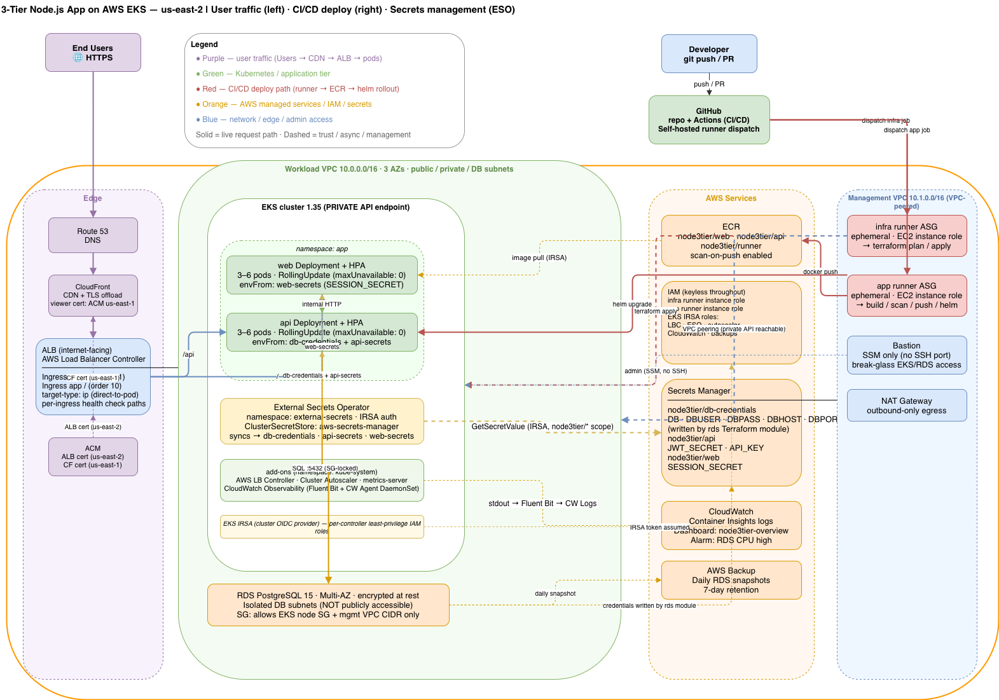

# Deployment Runbook: 3-Tier Node.js Application on AWS EKS Using Terraform and Self Hosted Runner

**Region:** `us-east-2` · **Terraform:** ≥ 1.15 · **EKS:** 1.35

Work through phases top to bottom. Each phase has a verify step — do not advance until it passes.

---

## Document Index

| Document | Purpose |
|---|---|
| **This file** | End-to-end deployment runbook (single source of truth) |
| [`docs/architecture.drawio`](docs/architecture.drawio) | Full system architecture diagram |
| [`docs/RUNNER-ARCHITECTURE-PLAN.md`](docs/RUNNER-ARCHITECTURE-PLAN.md) | Why self-hosted runners / identity model |
| [`docs/RUNNER-SETUP.md`](docs/RUNNER-SETUP.md) | Step-by-step runner fleet bring-up |
| [`docs/CDN-TLS.md`](docs/CDN-TLS.md) | CloudFront, ACM, TLS topology |
| [`docs/EDGE-AND-OBSERVABILITY.md`](docs/EDGE-AND-OBSERVABILITY.md) | ALB, CloudWatch, deploy order |
| [`docs/LOGGING.md`](docs/LOGGING.md) | CloudWatch Container Insights, log groups |
| [`docs/SECURITY-SETUP.md`](docs/SECURITY-SETUP.md) | Branch protection, required status checks |
| [`docs/RELEASE-MANAGEMENT.md`](docs/RELEASE-MANAGEMENT.md) | Branching model, approval gate, rollback |
| [`docs/ESO-OPERATOR.md`](docs/ESO-OPERATOR.md) | External Secrets Operator operational guide |

---

## Architecture Overview


---
Everything is self-hosted, keyless, and private. Two ephemeral runner fleets in the management VPC drive all infrastructure and application changes; no GitHub-hosted runner ever touches AWS.

```
  End User (HTTPS)
       │
  Route 53 → CloudFront (CDN) → ALB (internet-facing, LBC-managed)
                                      │            │
                                  / (web)     /api (api)
                                      │            │
                              ┌───────┴────────────┴───────┐
                              │  EKS cluster (PRIVATE API)  │
                              │  web pods · api pods        │
                              │  ESO controller             │
                              │  AWS LB Controller          │
                              │  Cluster Autoscaler         │
                              └────────────┬────────────────┘
                                           │ SQL :5432
                                     RDS PostgreSQL
                                     (Multi-AZ, isolated subnets)

  Management VPC (10.1.0.0/16) ←── VPC peering ──→ Workload VPC (10.0.0.0/16)
  ┌─────────────────────────────────────────┐
  │ infra runner ASG  →  terraform plan/apply│
  │ app runner ASG    →  build/scan/push/helm│
  │ bastion           →  SSM break-glass     │
  └─────────────────────────────────────────┘
```

### Identity Model — Keyless, No Static Credentials

| Actor | Identity | Scope |
|---|---|---|
| `infra` runner | EC2 instance role | Terraform: full infra deploy |
| `app` runner | EC2 instance role | ECR push + `helm`/`kubectl` rollout |
| In-cluster controllers (LBC, autoscaler, ESO, CloudWatch) | **EKS IRSA** (cluster OIDC) | Least-privilege AWS access per controller |
| GitHub-hosted quality/SAST jobs | None | No AWS access required |

> No GitHub OIDC. No ARC (in-cluster runners). No static access keys anywhere. Identity is EC2 instance role (runners) and EKS IRSA (controllers).

---

## Prerequisites

| Requirement | Detail |
|---|---|
| AWS account + admin credentials | For the one-time local bootstrap only |
| `terraform` ≥ 1.15 | Local machine |
| `aws` CLI | Local machine |
| `docker` with buildx | For building the runner image |
| GitHub PAT (classic, `repo` scope) | Runner self-registration token |
| GitHub repository | Target for self-hosted runners |

> After bootstrap, all subsequent operations run on the self-hosted runners, not locally.

---

## Phase 0 — Bootstrap (one-time, run locally by an admin)

The trust anchor. Creates the S3 state backend, management VPC, bastion, and both ephemeral runner fleets. Nothing here depends on the workload cluster — there is no circular dependency.

```bash
cd infra/terraform/bootstrap
cp terraform.tfvars.example terraform.tfvars
# Edit: set github_owner, github_repo, region
terraform init
terraform apply
terraform output   # note: state_bucket, mgmt_vpc_id, mgmt_route_table_ids,
                   #       bastion_role_arn, infra_runner_role_arn, app_runner_role_arn
```

**Store the runner registration token in SSM:**
```bash
aws ssm put-parameter \
  --name /node3tier/runner-registration-token \
  --type SecureString --overwrite \
  --value <GITHUB_PAT>
```

**Build and push the custom runner image** (baked with terraform/kubectl/helm/aws/docker):
```bash
REPO=$(terraform output -raw runner_repo_url)
REG=${REPO%/*}
aws ecr get-login-password --region us-east-2 \
  | docker login --username AWS --password-stdin "$REG"
docker buildx build --platform linux/amd64 -t "$REPO:latest" --push ../../../runner

# Point the fleets at the image and re-apply:
# Set runner_image = "<REPO>:latest" in terraform.tfvars, then:
terraform apply
```

**Migrate bootstrap state to S3** (optional but recommended):
```bash
# Uncomment the backend block in versions.tf, set bucket = <state_bucket>, then:
terraform init -migrate-state
```

**Wire bootstrap outputs into the root stack:**

1. Set `state_bucket` in `infra/backend.tf`.
2. Copy `mgmt_vpc_id`, `mgmt_route_table_ids`, `bastion_role_arn`, `infra_runner_role_arn`, `app_runner_role_arn` into `infra/environments/prod/prod.tfvars`.
3. Create GitHub Environments: `prod` (required reviewer) and `plan` (no reviewer).
4. Apply branch protection: `scripts/setup-branch-protection.sh <owner>/<repo>`.

 **Verify:** `infra` and `app` runners appear as **Idle** under *Repo → Settings → Actions → Runners*.

---

## Phase 1 — Infrastructure (runs on the `infra` runner via PR/merge)

A single Terraform root (`infra/`) provisions the complete AWS infrastructure. After bootstrap, this runs automatically on the `infra` self-hosted runner — open a PR to plan, merge to apply.

**What is created:**

| Module | Resources |
|---|---|
| `network` | Workload VPC (10.0.0.0/16), 3-AZ subnets (public/private/DB), NAT, peering |
| `eks` | EKS 1.29, private API endpoint, managed node group (3–6 × t3.medium, 3 AZs) |
| `ecr` | Repositories: `node3tier/web`, `node3tier/api` |
| `rds` | PostgreSQL 15, Multi-AZ, isolated DB subnets, encrypted at rest |
| `addons` | AWS Load Balancer Controller, Cluster Autoscaler, metrics-server (Helm, IRSA) |
| `external-secrets` | ESO operator (Helm), IRSA role, `ClusterSecretStore` (`aws-secrets-manager`) |
| `app-secrets` | Secrets Manager entries: `node3tier/api`, `node3tier/web` |
| `observability` | CloudWatch Container Insights add-on, dashboard, RDS CPU alarm |
| `backups` | AWS Backup plan with daily RDS snapshots |
| `cdn` | CloudFront distribution (origin = ALB, set after Phase 4) |
| `acm` | ACM certificates for ALB (us-east-2) and CloudFront (us-east-1) when `domain_name` is set |

**First run (or manual run from bastion):**
```bash
cd infra
terraform init
terraform apply -var-file=environments/prod/prod.tfvars
```

 **Verify:**
```bash
aws eks update-kubeconfig --region us-east-2 --name node3tier-eks
kubectl get nodes                                        # 3 Ready across 3 AZs
kubectl -n kube-system get pods                         # LBC, autoscaler, metrics-server Running
kubectl -n external-secrets get pods                    # ESO controller pods Running
kubectl get clustersecretstore aws-secrets-manager      # READY: True
```

---

## Phase 2 — Populate Application Secrets in Secrets Manager

The `app-secrets` module created two empty Secrets Manager entries. Populate them before deploying the application.

**API secrets** (`node3tier/api`) — JWT signing key and internal API key:
```bash
aws secretsmanager put-secret-value \
  --secret-id node3tier/api \
  --region us-east-2 \
  --secret-string '{
    "JWT_SECRET":  "<generate-a-48-char-random-string>",
    "API_KEY":     "<generate-a-32-char-random-string>"
  }'
```

**Web secrets** (`node3tier/web`) — session signing key:
```bash
aws secretsmanager put-secret-value \
  --secret-id node3tier/web \
  --region us-east-2 \
  --secret-string '{
    "SESSION_SECRET": "<generate-a-48-char-random-string>"
  }'
```

> The DB credentials secret (`node3tier/db-credentials`) is populated automatically by the `rds` module during Phase 1. Do not overwrite it.

 **Verify:**
```bash
aws secretsmanager get-secret-value --secret-id node3tier/api \
  --region us-east-2 --query SecretString --output text
```

---

## Phase 3 — Deploy the Application (runs on the `app` runner)

Push to `api/**` or `web/**` triggers the CI pipeline: unit tests → CodeQL → build → Trivy scan → push to ECR → `helm upgrade`. Deploy `api` before `web` (the web chart holds the shared Ingress group).

**First/manual deploy:**
```bash
aws eks update-kubeconfig --region us-east-2 --name node3tier-eks
REGISTRY=$(aws sts get-caller-identity --query Account --output text).dkr.ecr.us-east-2.amazonaws.com

for svc in api web; do
  docker build -t $REGISTRY/node3tier/$svc:bootstrap ./$svc
  docker push $REGISTRY/node3tier/$svc:bootstrap
done

helm upgrade --install api ./helm/api -n app --create-namespace \
  --set image.registry=$REGISTRY --set image.tag=bootstrap --wait

helm upgrade --install web ./helm/web -n app \
  --set image.registry=$REGISTRY --set image.tag=bootstrap --wait
```

ESO automatically syncs secrets from Secrets Manager into Kubernetes Secrets (`db-credentials`, `api-secrets`, `web-secrets`) in the `app` namespace. Pods mount these as environment variables via `envFrom`.

**Verify:**
```bash
kubectl -n app get pods                      # web and api pods Running (3 each)
kubectl -n app get externalsecret           # db-credentials, api-secrets, web-secrets: SecretSynced
kubectl -n app get secret db-credentials   # exists
```

---

## Phase 4 — Ingress and ALB

The `api` and `web` Helm charts each render a Kubernetes **Ingress** in the same ALB group (`app`). The AWS Load Balancer Controller provisions a **single internet-facing ALB** from them. Each Ingress carries its own health check path, eliminating the 404 failure that occurs when a shared path is used for both tiers.

| Ingress | Chart | Path | Health check path | Group order |
|---|---|---|---|---|
| `api` | `helm/api` | `/api` | `/api/status` | 1 (evaluated first) |
| `app` | `helm/web` | `/` | `/` | 10 (catch-all) |

```bash
# Wait for the ALB to be provisioned (~2–3 min):
kubectl -n app get ingress -w

ALB=$(kubectl -n app get ingress app \
  -o jsonpath='{.status.loadBalancer.ingress[0].hostname}')

curl -s "http://$ALB/"           # web UI
curl -s "http://$ALB/api/status" # {"status":"ok","db":"connected"}
```

✅ **Verify:** Both target groups in the AWS console show **Healthy** for all registered targets.

---

## Phase 5 — CDN and TLS (optional, requires a domain)

CloudFront and ACM are provisioned by the Terraform root. Two ACM certificates are required: one in **us-east-1** for CloudFront (global control plane), one in **us-east-2** for the ALB.

```hcl
# infra/environments/prod/prod.tfvars
web_alb_dns_name = "<alb-hostname-from-phase-4>"
domain_name      = "app.example.com"    # leave "" to skip
route53_zone_id  = "Z0123456789ABC"     # leave "" to skip
```

```bash
cd infra
terraform apply -var-file=environments/prod/prod.tfvars

# Enable HTTPS on the ALB:
helm upgrade --install web ./helm/web -n app --reuse-values \
  --set ingress.certificateArn=$(terraform output -raw alb_certificate_arn)

terraform output cloudfront_domain   # point DNS here
```

✅ **Verify:**
```bash
curl -I https://app.example.com            # HTTP/2 200 via CloudFront
curl -I http://app.example.com             # 301 → https
curl -s https://app.example.com/api/status # {"status":"ok","db":"connected"}
```

See [`docs/CDN-TLS.md`](docs/CDN-TLS.md) for full TLS topology and the two-certificate rationale.

---

## Phase 6 — Steady-State Automation

After bootstrap, all operations are driven by the self-hosted runners through GitHub Actions workflows.

```
INFRA:
  PR targeting main (infra/**) → infra.yml plan   [runner: infra, env: plan]
  Merge to main               → infra.yml apply   [runner: infra, env: prod, gated]
  On-demand                   → infra-component.yml (single module target)

APP:
  Push api/** or web/**  → {api,web}-ci.yml → _service-ci.yml
    ├── quality (unit tests + npm audit)   [runner: GitHub-hosted, no AWS]
    ├── codeql  (SAST)                     [runner: GitHub-hosted, no AWS]
    ├── build-push (build → Trivy → ECR)   [runner: app, instance role]
    └── deploy  (helm upgrade + rollout)   [runner: app, env: prod, gated]
```

The `prod` GitHub Environment requires a human approver before any `apply` or `deploy` job runs. See [`docs/RELEASE-MANAGEMENT.md`](docs/RELEASE-MANAGEMENT.md).

---

## Observability

CloudWatch Container Insights is deployed as a managed EKS add-on (part of Phase 1). No additional configuration is required.

```bash
# Tail live application logs:
aws logs tail /aws/containerinsights/node3tier-eks/application \
  --follow --region us-east-2

# CloudWatch console → Dashboards → node3tier-overview
# Alarm: node3tier-rds-cpu-high (RDS CPU > 80% for 3 min)
```

See [`docs/LOGGING.md`](docs/LOGGING.md) for log group reference and query examples.

---

## Make Targets (convenience only — CI does not use these)

| Target | Equivalent |
|---|---|
| `make init` / `plan` / `apply` | `cd infra && terraform … -var-file=environments/prod/prod.tfvars` |
| `make kubeconfig` | `aws eks update-kubeconfig --region us-east-2 --name node3tier-eks` |
| `make deploy TAG=<t>` | `helm upgrade --install api … && helm upgrade --install web …` |
| `make bastion` | `aws ssm start-session --target <bastion-instance-id>` |

---

## Teardown

```bash
# 1. Remove app and Ingress/ALB first (controller-managed; must go before VPC destroy):
helm -n app uninstall web api

# 2. Destroy the workload stack:
cd infra
terraform destroy -var-file=environments/prod/prod.tfvars

# 3. Destroy the bootstrap stack (management VPC, runners, state bucket):
cd terraform/bootstrap
terraform destroy
```

> Always uninstall the Helm releases before destroying the VPC. The AWS Load Balancer Controller owns the ALB — if the VPC is destroyed first, the controller-managed ALB can leave orphaned resources that block a clean re-apply.

---

## Requirements Coverage

| Requirement | Implementation |
|---|---|
| 3-tier architecture | Public/app/DB subnet tiers across 3 AZs; SGs enforce isolation |
| Web + API publicly accessible | Single internet-facing ALB; path routing `/` → web, `/api` → api |
| Database not publicly accessible | RDS in isolated DB subnets; SG allows only EKS node SG + mgmt VPC CIDR |
| Secure admin access | Private EKS API endpoint; bastion via SSM (no SSH exposed); VPC peering |
| Secure CI/CD | Self-hosted ephemeral runners in mgmt VPC; EC2 instance roles; gated `prod` environment |
| Infrastructure as Code | 100% Terraform; native S3 state locking (no DynamoDB required) |
| High availability | 3 AZs, min 3 nodes, Cluster Autoscaler, RDS Multi-AZ, pod topology spread |
| Zero-downtime deploys | Helm rolling update with `maxUnavailable: 0` and readiness probes |
| Automated CI/CD pipeline | tests → SCA → CodeQL → Trivy → ECR push → Helm rollout |
| Daily backups | RDS automated backups (7-day retention) + AWS Backup plan |
| Centralised logging | CloudWatch Container Insights (Fluent Bit + CW Agent DaemonSet) |
| CDN + TLS | CloudFront + ACM; two certs (us-east-1 for CF, us-east-2 for ALB) |
| Secrets management | External Secrets Operator + AWS Secrets Manager; IRSA auth; no static keys |
| Container security | Trivy image scan (HIGH/CRITICAL = build fail); ECR scan-on-push |
| Supply-chain security | CodeQL, Gitleaks, npm audit, Dependabot, OpenSSF Scorecard |
